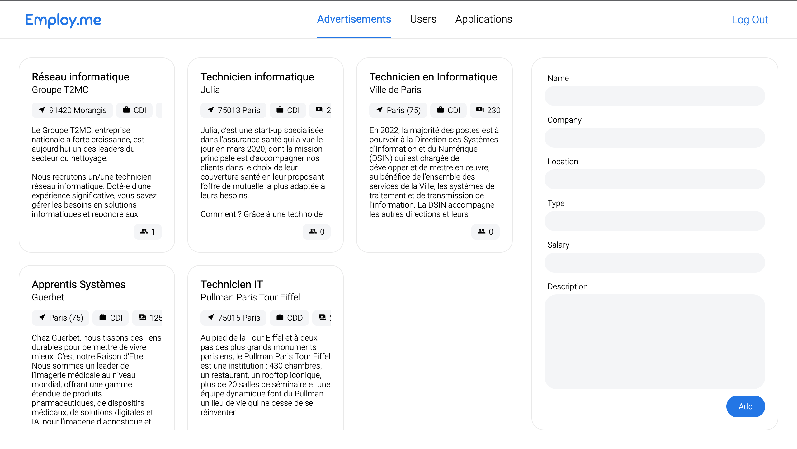
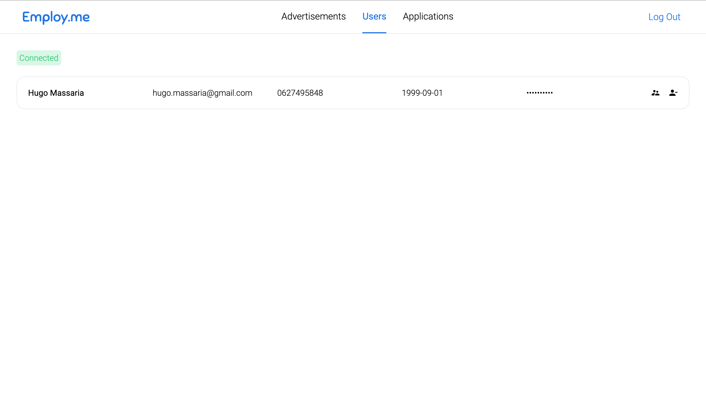
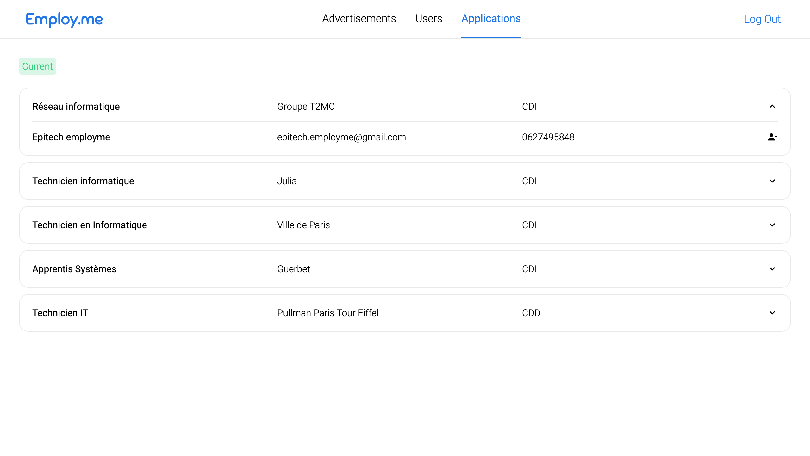
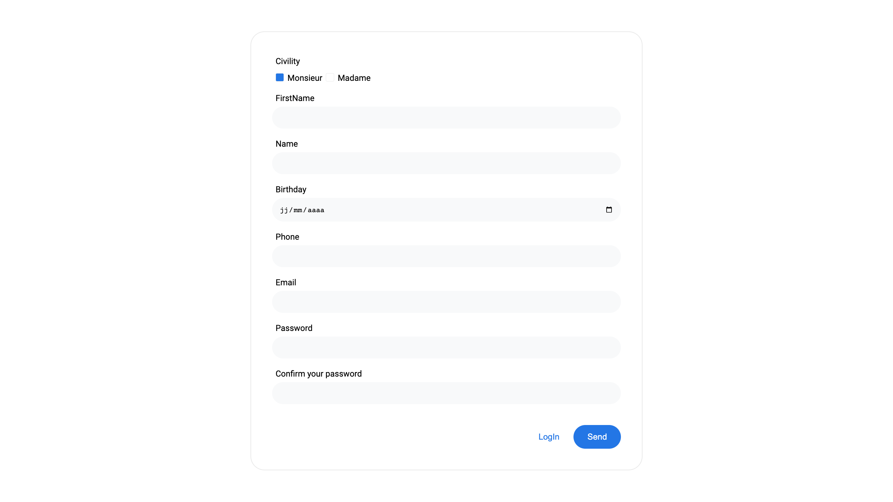
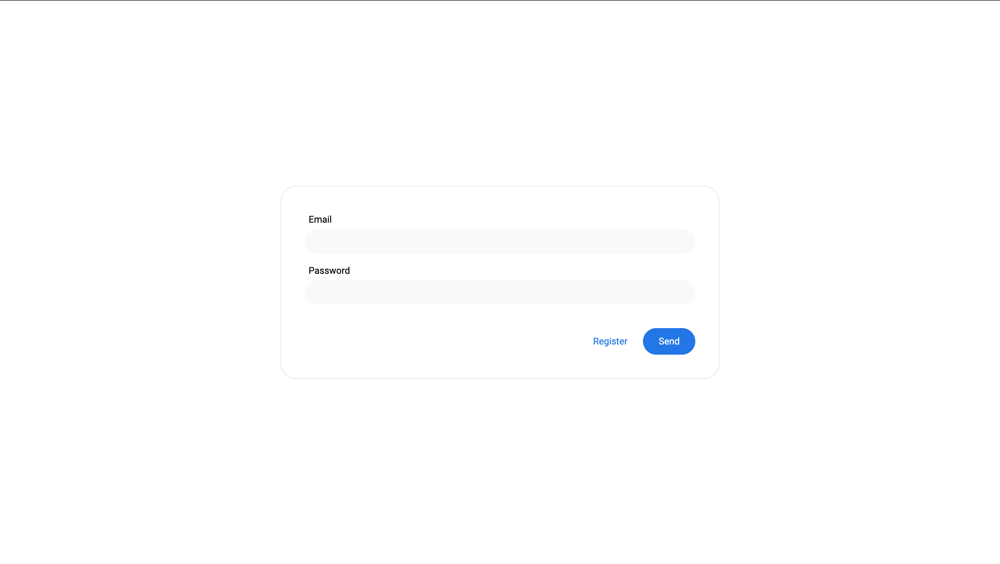
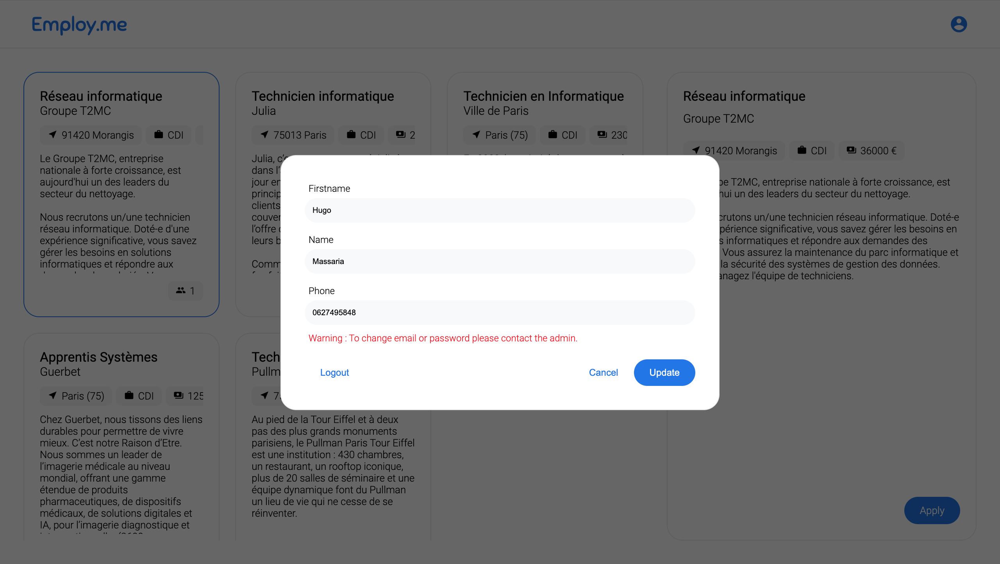
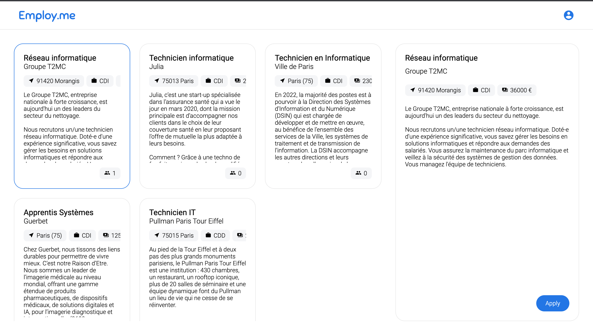
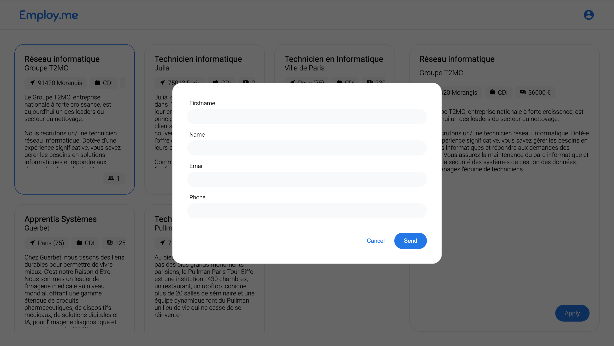

# T-WEB-501-LIL-5-1-jobboard-hugo.massaria

# Employ.me

## Description du projet 

Le projet Job-Board consistait à faire un site d'offres d'emplois avec certaines restrictions.
Il devait contenir des comptes utilisateurs pour les personnes voulant postuler à des offres régulièrement sans avoir à remplir un formulaire à chaque postulation.
Il devait afficher les offres d'emplois peu importe si l'on était connecté ou non, on pouvait ainsi y postuler connecté ou non également.

Un administrateur devait pouvoir gérer toute la base de données du site depuis son panel d'administration, c'est-à-dire, les utilisateurs, les offres et les postulations.

A chaque postulation d'un utilisateur à une offre, l'administrateur devait recevoir un message (par mail dans notre cas).

## Nos fonctionnalités :

### Admin :

* Création/Modification/Suppression d'une offre

* Upgrade/Suppression du compte utilisateur

* Suppression d'une postulation

### Utilisateur :

* Inscription et Connexion

* Modification de ses données utilisateur

 

Attention : l'utilisateur ne peut pas modifier son adresse mail et son mot de passe. Pour cela, il doit contacter l'administrateur.

 

* Postulation à une offre avec ou sans connexion

 

**À chaque nouvelle postulation, un email est envoyé à l'administrateur pour l'en informer (cf. Données utiles) et à l'utilisateur pour lui confirmer sa candidature.**

## Les langages utilisés :

* PHP (Backend)

* JS (Frontend)

* HTML

* CSS

Aucun framework n'a été utilisé par la réalisation de ce site.

## Données utiles

Admin | identifiant | mot de passe
------------ | ------------ | -------------
Gmail | epitech.employme@gmail.com | epitechpremscemployme
Employ.me | epitech.employme@gmail.com | Azerty12345

Un mail est envoyé à l'email utilisé pendant l'inscription pour confirmer que l'utilisateur est inscrit, il se trouve généralement dans les __spams__.
La base de données est dans le .sql du repository GIT, il faut __créer une schéma "job_board" et y injecter le script du .sql pour pouvoir utiliser le site__.
